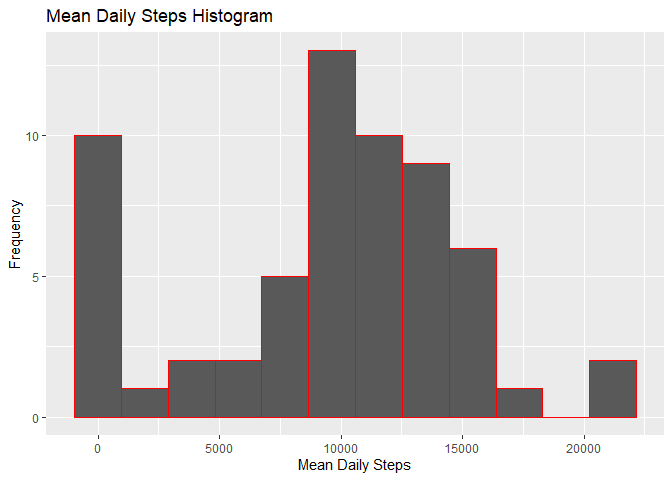
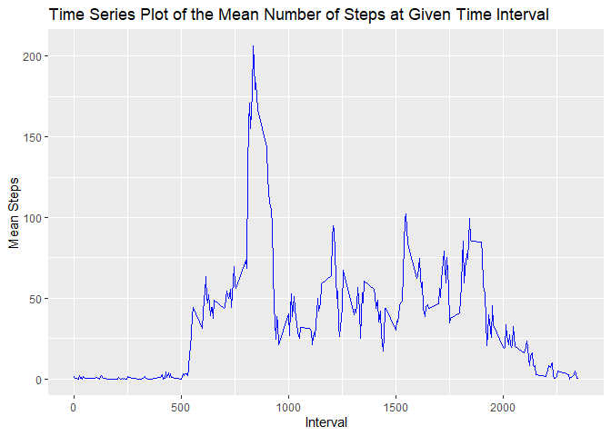
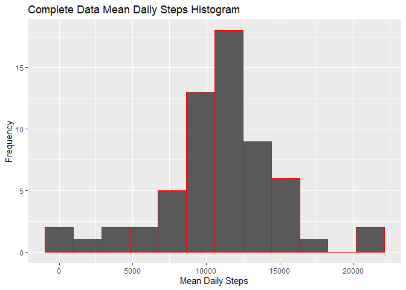
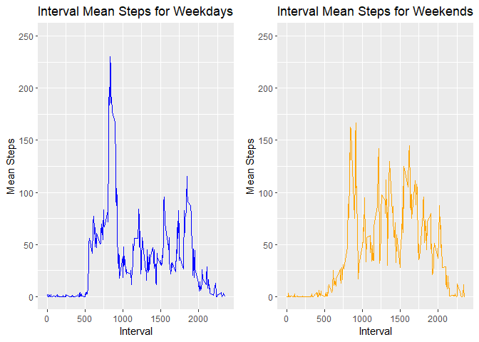

## Loading and preprocessing the data


```r
library(ggplot2)
```

```
## Warning: package 'ggplot2' was built under R version 4.0.2
```

```r
library(dplyr)
```

```
## Warning: package 'dplyr' was built under R version 4.0.2
```

```
## 
## Attaching package: 'dplyr'
```

```
## The following objects are masked from 'package:stats':
## 
##     filter, lag
```

```
## The following objects are masked from 'package:base':
## 
##     intersect, setdiff, setequal, union
```

```r
library(ggpubr)
```

```
## Warning: package 'ggpubr' was built under R version 4.0.2
```
For this analysis the ggplot2, ggpubr, and dplyr packages were used, the data was
loaded through the read.csv() function

```r
Activity_data <- read.csv(unz("activity.zip", "activity.csv"))
```

The date column of the Activity_data data frame was converted to POSIXlt through
the use of the strptime() function

```r
Activity_data$date <- strptime(Activity_data$date, format = "%Y-%m-%d")
```

## What is mean total number of steps taken per day?
The total number of steps taken each day was calculated, from which the mean and
median are calculated

```r
total_daily_steps <- Activity_data %>% 
        group_by(date) %>% 
        summarise(daily_steps = sum(steps, na.rm = TRUE))
```

```
## `summarise()` ungrouping output (override with `.groups` argument)
```

```r
daily_steps_mean <- mean(total_daily_steps$daily_steps)
daily_steps_median <- median(total_daily_steps$daily_steps)
```
The mean total number of steps taken every day is 

```r
daily_steps_mean
```

```
## [1] 9354.23
```
and the median is 

```r
daily_steps_median
```

```
## [1] 10395
```
Pictured here is a histogram of the mean daily steps taken

```r
daily_steps_plot <- ggplot(data = total_daily_steps, aes(daily_steps)) + 
        geom_histogram(col = "red", bins = 12) +
        ggtitle("Mean Daily Steps Histogram") +
        xlab("Mean Daily Steps") +
        ylab("Frequency") 
        
        
daily_steps_plot
```

<!-- -->

## What is the average daily activity pattern?
The mean value of each interval over the series of days was calculated

```r
interval_mean_steps <- Activity_data %>% 
        group_by(interval) %>% 
        summarise(mean_steps = mean(steps, na.rm = TRUE))
```

```
## `summarise()` ungrouping output (override with `.groups` argument)
```
And a time series plot was constructed to illustrate the daily pattern of steps
over all the available days

```r
time_series_plot <- ggplot(data = interval_mean_steps, aes(interval, mean_steps)) +
        geom_line(col = "blue") +
        ggtitle("Time Series Plot of the Mean Number of Steps at Given Time Interval") +
        xlab("Interval") +
        ylab("Mean Steps") 
time_series_plot
```

<!-- -->

The time interval that had the largest mean steps was

```r
max_average_interval <- interval_mean_steps[which.max(interval_mean_steps$mean_steps),]
max_average_interval[,1]
```

```
## # A tibble: 1 x 1
##   interval
##      <int>
## 1      835
```
## Imputing missing values
The total number of missing values was calculated using the is.na and sum functions
The value is:

```r
total_na_row <- sum(is.na(Activity_data[,"steps"]))
total_na_row
```

```
## [1] 2304
```

The na values were replaced with the time interval average as calculated above


```r
Complete_Activity_Data <- Activity_data

for(i in 1:17568){
        if (is.na(Complete_Activity_Data[i,"steps"])){
                Complete_Activity_Data[i, "steps"] <- interval_mean_steps[
                        which(Complete_Activity_Data[i, "interval"] == 
                                      interval_mean_steps[,"interval"]), 
                        "mean_steps"]
        }
}
```
A new mean and median value were calculated from a new total daily steps calculation

```r
complete_total_daily_steps <- Complete_Activity_Data %>% 
        group_by(date) %>% 
        summarise(complete_daily_steps = sum(steps, na.rm = TRUE))
```

```
## `summarise()` ungrouping output (override with `.groups` argument)
```

```r
## Calculate Mean and Median of complete data set total daily steps
complete_daily_steps_mean <- mean(complete_total_daily_steps$complete_daily_steps)
complete_daily_steps_median <- median(complete_total_daily_steps$complete_daily_steps)
```
The new mean is:

```r
complete_daily_steps_mean
```

```
## [1] 10766.19
```
The new median is:

```r
complete_daily_steps_median
```

```
## [1] 10766.19
```
Both the new mean and the new median have changed

A histogram of the Complete Data Set was constructed

```r
complete_daily_steps_plot <- ggplot(data = complete_total_daily_steps, 
                                    aes(complete_daily_steps))+ 
                                    geom_histogram(col = "red", bins = 12)+
                                    ggtitle("Complete Data Mean Daily Steps Histogram")+
                                    xlab("Mean Daily Steps")+
                                    ylab("Frequency")
complete_daily_steps_plot
```

<!-- -->

## Are there differences in activity patterns between weekdays and weekends?
A new column was added to the Complete_Activity_Data data frame delineating whethere
a given date was a weekend or a weekday

```r
## Creating a new column that records whether a given date is a weekday or a weekend
weekday <- c(1 , 2, 3, 4, 5)
weekend <- c(0, 6)
Complete_Activity_Data$Day <- ifelse(Complete_Activity_Data$date$wday %in% weekday, "Weekday", "Weekend")
table(Complete_Activity_Data$Day)
```

```
## 
## Weekday Weekend 
##   12960    4608
```

Using the new column the data was grouped into Weekday or Weekend and new interval
means were calculated

```r
Weekday_mean_interval_steps <- Complete_Activity_Data %>%
        subset(Day == "Weekday") %>%
        group_by(interval) %>% 
        summarise(mean_steps = mean(steps, na.rm = TRUE))
```

```
## `summarise()` ungrouping output (override with `.groups` argument)
```

```r
Weekend_mean_interval_steps <- Complete_Activity_Data %>%
        subset(Day == "Weekend") %>%
        group_by(interval) %>% 
        summarise(mean_steps = mean(steps, na.rm = TRUE))
```

```
## `summarise()` ungrouping output (override with `.groups` argument)
```
The two datasets were ploted as time series plots to illustrate the difference
between the interval mean steps of weekdays vs the interval mean steps of weekends


```r
Weekday_plot <- ggplot(Weekday_mean_interval_steps, aes(interval, mean_steps)) + 
        geom_line(col = "blue")+
        ggtitle("Interval Mean Steps for Weekdays")+
        xlab("Interval")+
        ylab("Mean Steps")+
        ylim(0,250)
Weekend_plot <- ggplot(Weekend_mean_interval_steps, aes(interval, mean_steps)) + 
        geom_line(col = "Orange")+
        ggtitle("Interval Mean Steps for Weekends")+
        xlab("Interval")+
        ylab("Mean Steps")+
        ylim(0,250)
figure <- ggarrange(Weekday_plot, Weekend_plot, ncol = 2)
figure
```

<!-- -->
